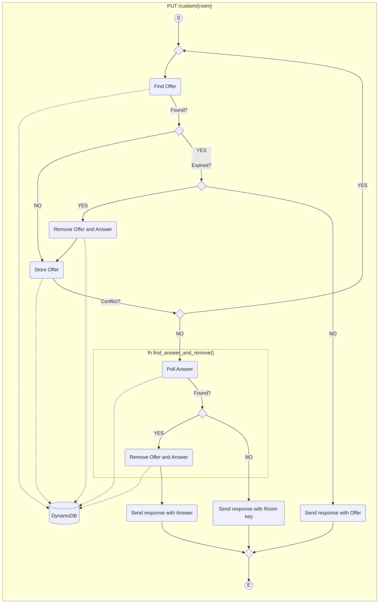
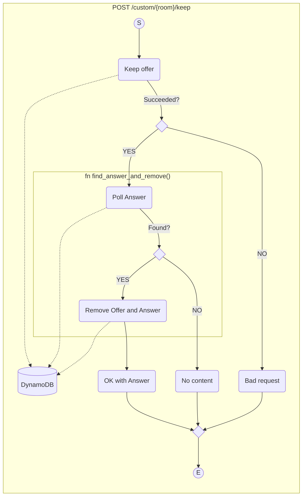
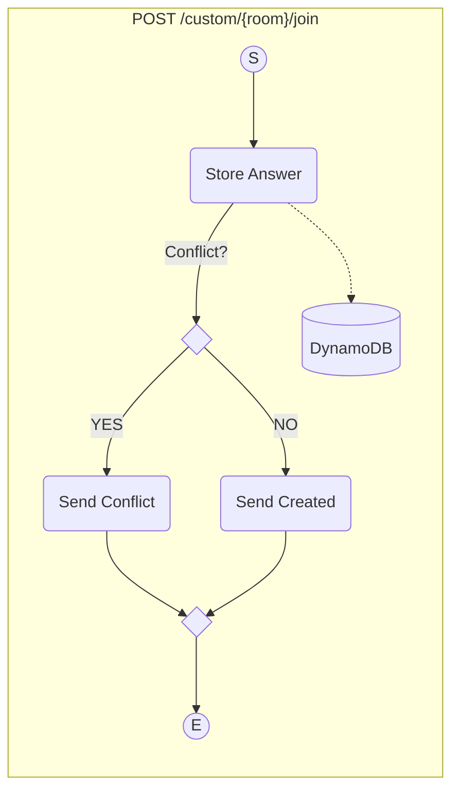
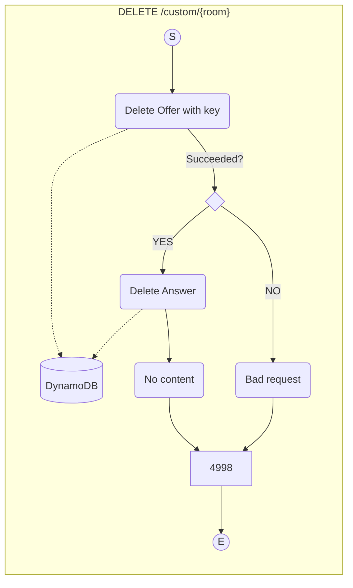
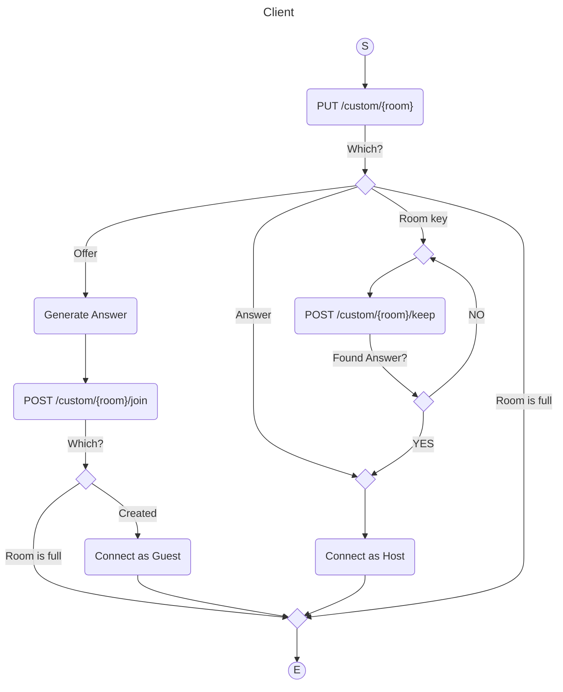

The room is like a mailbox.

* Polling interval: 3 sec
* Room expires: 10 sec

```mermaid
flowchart TB
  DB[(DynamoDB)]
  0065 -.-> DB

  subgraph 0000 ["PUT /custom/{room}"]
    direction TB
    0001((S))
    0001 --> 0005{ }
    0005 --> 0010(Find Offer)
    0010 -.-> DB
    0010 -- Found? --> 0020{ }

    0020 -- NO --> 0050(Store Offer)
    0050 -.-> DB
    0050 -- Conflict? --> 0055{ }

    0055 -- YES --> 0005

    0055 -- NO --> 0065(Poll Answer)
    subgraph "fn find_answer_and_remove()"
      0065 -- Found? --> 0070{ }

      0070 -- YES --> 0100(Remove Offer and Answer)
    end
    0100 -.-> DB
    0100 --> 0110(Send response with Answer)
    0110 --> 0998

    0020 -- YES<br><br>Expired? --> 0120{ }

    0120 -- YES --> 0130(Remove Offer and Answer)
    0130 --> 0050
    0130 -.-> DB

    0070 -- NO --> 0080(Send response with Room key)
    0080 --> 0998

    0120 -- NO --> 0030(Send response with Offer)

    0030 --> 0998{ }

    0998 --> 0999((E))
  end
```

```mermaid
flowchart TB
  DB[(DynamoDB)]

  subgraph 3000 ["POST /custom/{room}/keep"]
    direction TB
    3001((S))
    3001 --> 3010(Keep offer)
    3010 -.-> DB
    3010 -- Succeeded? --> 3020{ }

    3020 -- YES --> 3065(Poll Answer)
    3065 -.-> DB
    subgraph "fn find_answer_and_remove()"
      3065 -- Found? --> 3070{ }

      3070 -- YES --> 3100(Remove Offer and Answer)
    end
    3100 -.-> DB
    3100 --> 3110(OK with Answer)
    3110 --> 3998

    3070 -- NO --> 3080(No content)
    3080 --> 3998

    3020 -- NO --> 3030(Bad request)
    3030 --> 3998{ }
    3998 --> 3999((E))
  end
```

```mermaid
flowchart TB
  DB[(DynamoDB)]

  subgraph "POST /custom/{room}/join"
    direction TB
    1001((S))
    1001 --> 1010(Store Answer)
    1010 -.-> DB
    1010 -- Conflict? --> 1020{ }

    1020 -- YES --> 1030(Send Conflict)
    1030 --> 1998{ }

    1020 -- NO --> 1100(Send Created)
    1100 --> 1998

    1998 --> 1999((E))
  end
```

```mermaid
flowchart TB
  DB[(DynamoDB)]

  subgraph "DELETE /custom/{room}"
    direction TB
    4001((S))
    4001 --> 4010(Delete Offer with key)
    4010 -.-> DB
    4010 -- Succeeded? --> 4020{ }

    4020 -- YES --> 4030(Delete Answer)
    4030 -.-> DB
    4030 --> 4040(No content)
    4040 --> 4998

    4020 -- NO --> 4100(Bad request)
    4100 --> 4998

    4998 --> 4999((E))
  end
```

```mermaid
---
title: Client
---

flowchart TB
  direction TB

  2000((S))
  2000 --> 2020("PUT /custom/{room}")
  2020 -- Which? --> 2030{ }

  2030 -- Offer --> 2040(Generate Answer)
  2040 --> 2060("POST /custom/{room}/join")
  2060 -- Which? --> 2070{ }

  2070 -- Room is full --> 2998

  2070 -- Created --> 2080(Connect as Guest)
  2080 --> 2998{ }

  2030 -- Answer --> 2200{ }
  2200 --> 2210(Connect as Host)
  2210 --> 2998


  2030 -- Room key --> 2300{ }
  2300 --> 2320("POST /custom/{room}/keep")
  2320 -- Found Answer? --> 2330{ }

  2330 -- YES --> 2200
  2330 -- NO --> 2300

  2030 -- Room is full --> 2998

  2998 --> 2999((E))
```
