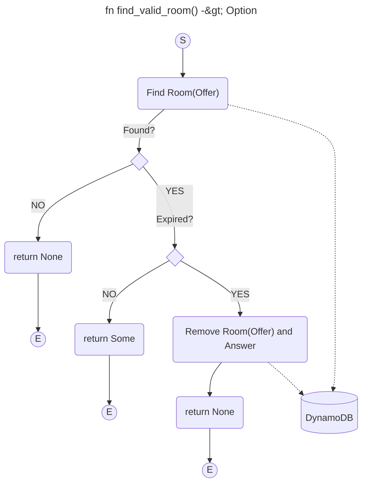
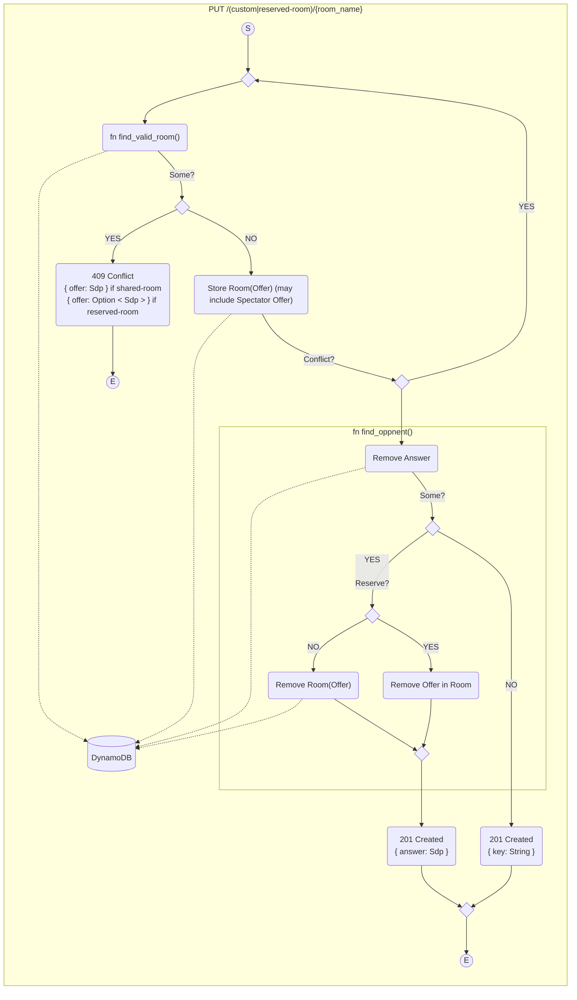
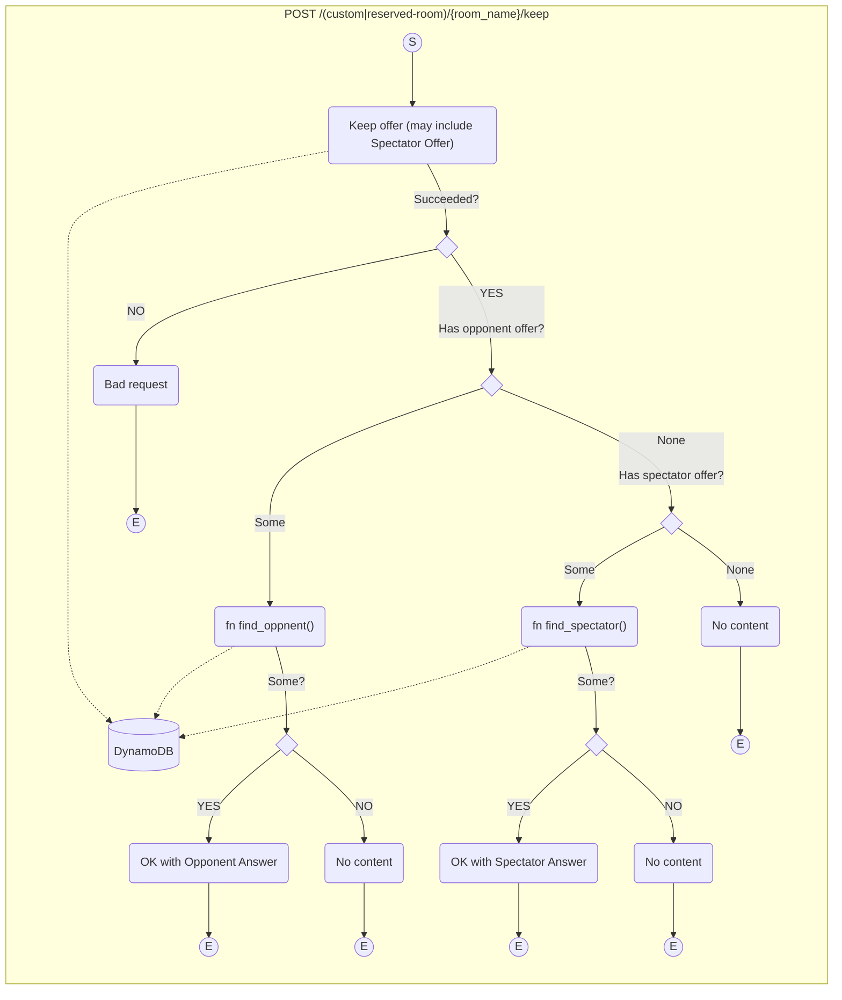
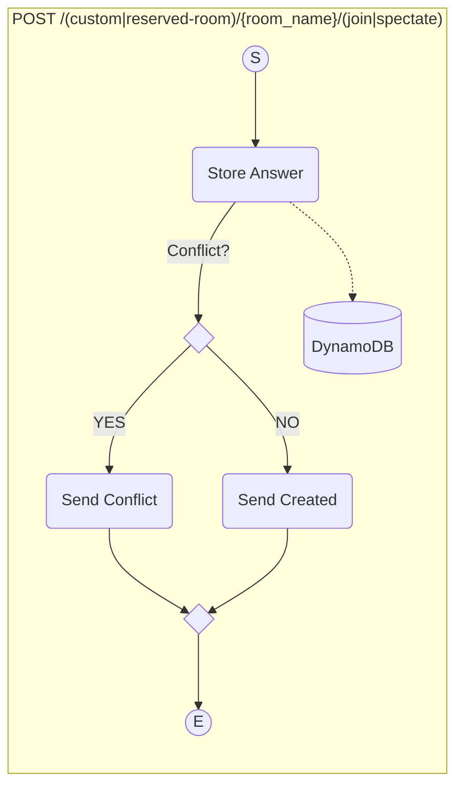
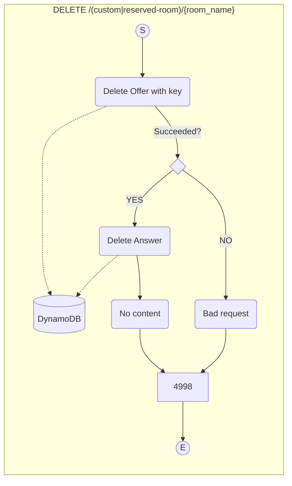
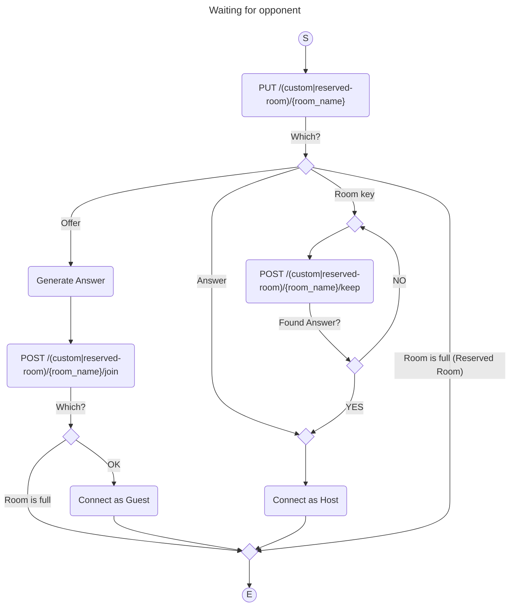
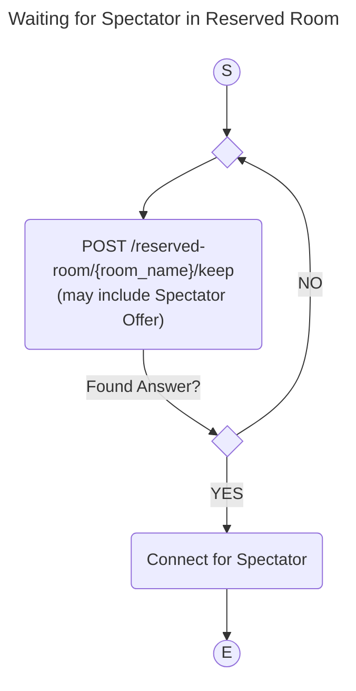
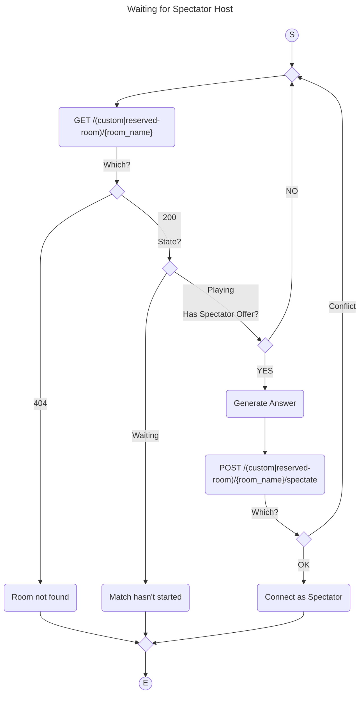

# activity-diagrams

The room is like a mailbox.

- Polling interval: 3 sec
- Room expires: 10 sec

## Why shared/reserved ?

- リザーブドルームが作成されることで共用ルームが制限されるべきではない
- リザーブドルームは共用ルームよりも維持費がかかるので共用ルームよりも選択しにくくあるべきだ

----

